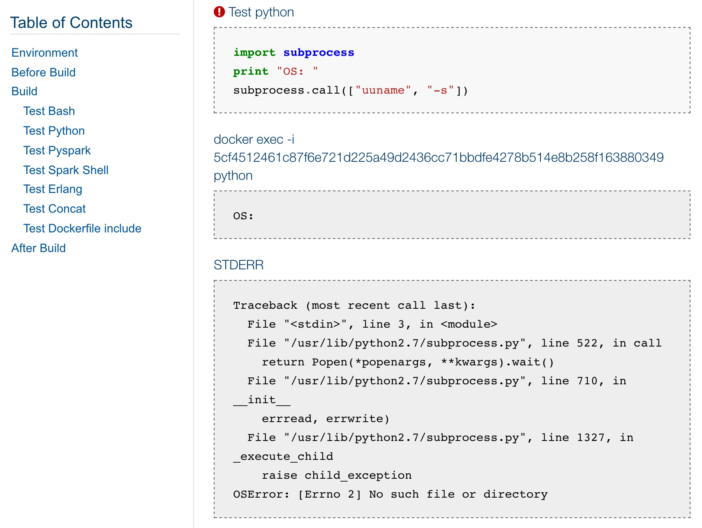
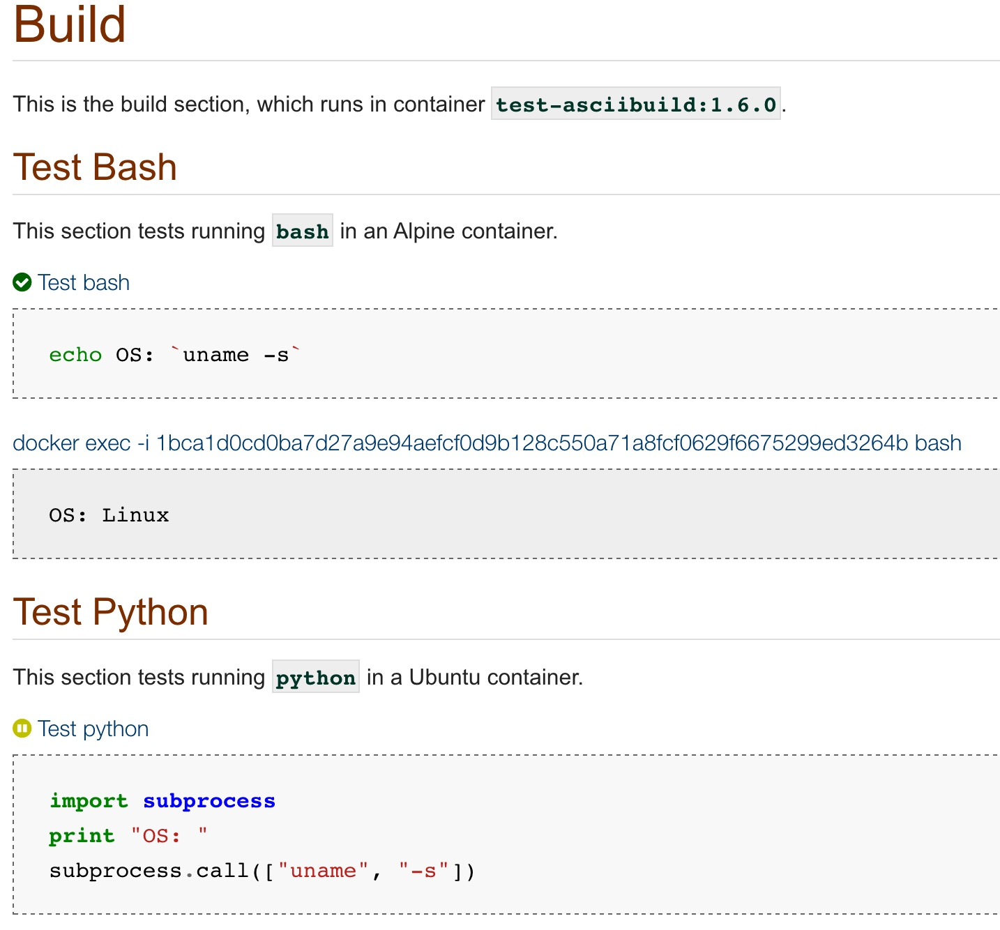

= Usage

To use `asciibuild` on your Asciidoctor files, make sure you add the require flag to your invocation of `asciidoctor` or just use the `asciibuild` executable that was insalled with the gem.

== Running asciibuild

In a stock Asciidoctor file, this won't do anything other than process the `.adoc` into a file in the `abuild/` directory using your preferred backend (`html` by default). If you want `asciibuild` to EVAL your listing blocks, just add a style to them that conforms to the pattern `[asciibuild,{lang}]`, where `lang` is either one of the built-in supported languages, or an executable that accepts input on `STDIN`. `asciibuild` will create a process based on the name of the interpreter in use (e.g. `python`) and pipe the content of the listing block into the process via `STDIN`. Any output (STD or ERR) is captured and written to the result document in the `abuild/` directory.

[source,bash]
----
asciibuild build.adoc

... output ...

open abuild/build.html
----

Currently, the built-in supported languages are described in the following list. Required settings are listed with `{attribute}` where the value must go and optional attributes are listed with their default settings.

.Supported languages
* Any interpreter that accepts `<STDIN>` as input. Examples: `bash` and `python`.
* Docker
  - `[asciibuild, Dockerfile, image={name}, file=Dockerfile, overwrite=true, run=false, build_opts="", run_opts=""]` _For more on using the Docker support, visit the link:DOCKER.adoc[DOCKER] document_
* Spark
  - Scala: `[asciibuild, spark-shell]`
  - Python: `[asciibuild, pyspark]`

== Using Shell

To use a `bash` or `sh` shell, add the `[asciibuild,bash]` or `[asciibuild,sh]` style to any listing block.

[listing]
[source,asciidoc]
....
.Execute BASH in asciibuild
[source,bash]
[asciibuild,bash]
----
echo Hello `uname -s`
----
....

== Using Spark

`asciibuild` supports http://spark.apache.org/[Apache Spark] out-of-the-box. It supports both http://spark.apache.org/docs/latest/programming-guide.html#tab_python_0[pyspark] and http://spark.apache.org/docs/latest/programming-guide.html#tab_scala_0[spark-shell] (Python and Scala, respectively). To use the Spark support in `asciibuild`, add a style of `[asciibuild,pyspark]` for PySpark or `[asciibuild,spark-shell]` for Scala.

This example is taken from the Spark documentation on using Python with Spark:

[listing]
[source,asciidoc]
....
.Execute PySpark in asciibuild
[source,python]
[asciibuild,pyspark]
----
from pyspark import SparkContext

logFile = "README.adoc"
sc = SparkContext("local", "Simple App")
logData = sc.textFile(logFile).cache()

numAs = logData.filter(lambda s: 'a' in s).count()
numBs = logData.filter(lambda s: 'b' in s).count()

print("Lines with a: %i, lines with b: %i" % (numAs, numBs))
----
....

== Using other Languages

`asciibuild` will support any language who's executable accepts `<STDIN>` as input. If you can pipe content into it, you can use it in `asciibuild`. Here's an example using Python:

[listing]
[source,asciidoc]
....
.Execute Python in asciibuild
[source,python]
[asciibuild,python]
----
import subprocess
print "OS:"
subprocess.call(["uname", "-s"])
----
....

NOTE: The styles `[source,bash]` and `[source,python]` are for the benefit of editors that recognize Asciidoc and will show source code formatting in a preview. `asciibuild` will add its own styles to the resulting blocks, regardless of what is set in the source document, so the generated document will be formatted correctly.

== Handling Output

Output of commands described in `asciibuild`-enabled listing blocks is inserted directly into the rendered document, immediately following the block definition. If there is any output on `<STDERR>` it will also be rendered into the document. If the return code of the command is anything other than `0`, the step will be marked as "in error" and subsequent steps will be skipped. A red warning icon will appear next to the step title to indicate the error. The following screenshot shows STDOUT and STDERR when an error occurs.

== Advanced Usage

It's possible to execute only a given set of blocks in an `asciibuild` document by setting the document attribute `sections` to a comma-separate list of regexes that will match section titles that should be executed. If a section title does not match one of these regexes, it will be marked in the resulting document as "skipped" with a yellow pause icon, as in the following example and screenshot.

NOTE: Any section that starts with the name "Before" or "After" will *always* be run, regardless of the setting of `sections`. This is to provide setup and cleanup functionality.

.Execute only One Section
[source,bash]
----
asciibuild -a sections="Test Bash" test/test-block-processor.adoc
----

